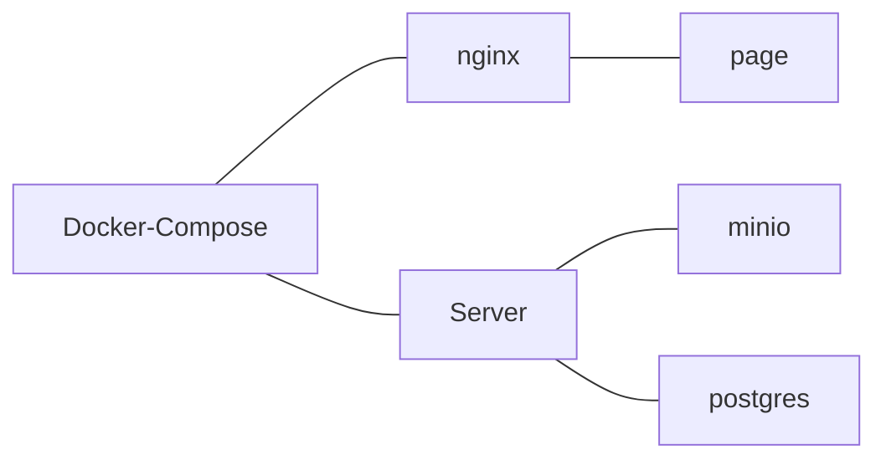
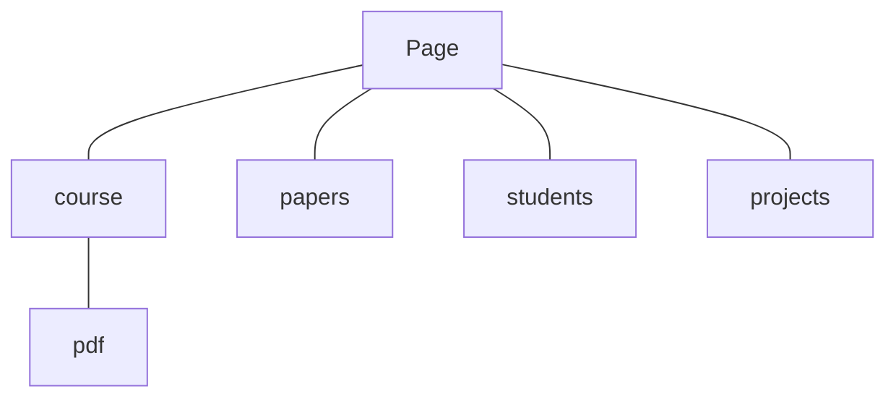
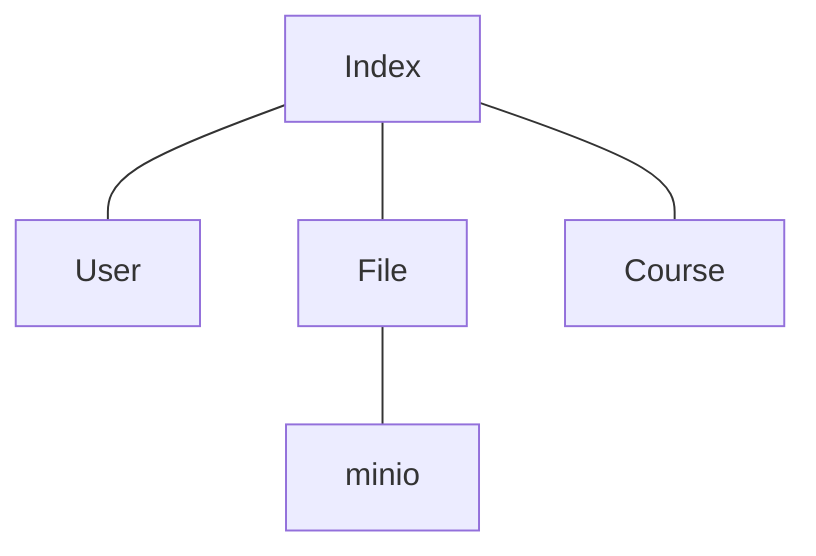
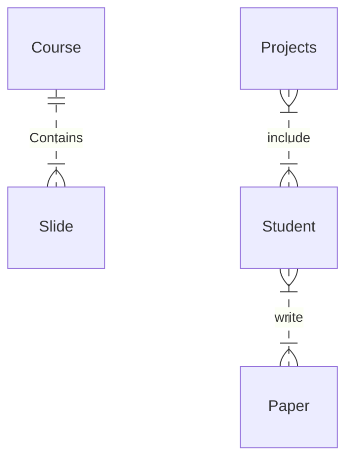

# aclab

## system model:

### overall

### frontend

### backend

### database

#### graph

#### File
| colume | type | property | description |
|---|---|---|---|
| id | unsign int | pk | |
| name | varChar | | |
| path | varChar | unique | path in minio |

#### course

| colume | type | property | description |
|---|---|---|---|
| id | unsign int | pk | |
| name | varChar | | |
| year | integer |  | |
| semester | enum | | [ fall, spring ] |

#### Slide

| colume | type | property | description |
|---|---|---|---|
| id | unsign int | pk | |
| name | varChar | | |
| course_id | unsign int | fk - `course.id` | |
| file_id | unsign int | fk - `file.id` | |

#### Paper

| colume | type | property | description |
|---|---|---|---|
| id | unsign int | pk | |
| name | varChar | | |
| file_id | unsign int | fk - `file.id` | |
| year | int | | |

#### Student

| colume | type | property | description |
|---|---|---|---|
| id | unsign int | pk | |
| name | varChar | | |
| year | int | | |
| research | varchar | | |

#### Research Paper

| colume | type | property | description |
|---|---|---|---|
| student_id | unsign int | fk - `student.id` | |
| paper_id | unsign int | fk - `paper.id` |  |
| graduation | boolean | | default = 0 |

#### Project

| colume | type | property | description |
|---|---|---|---|
| id | unsign int | pk | |
| name | varChar | | 校內計畫編號 |
| school_id | varChar | | 校內計畫編號 | 
| project_id | varChar | | 計畫編號 |
| exec_time | varChar | | 計畫執行期限 |
| active_time | varChar | | 學習活動期間 |

#### Project_Student

| colume | type | property | description |
|---|---|---|---|
| student_id | unsign int | fk - `student.id` | |
| project_id | unsign int | fk - `project.id` |  |
| scholarship | int | |  |